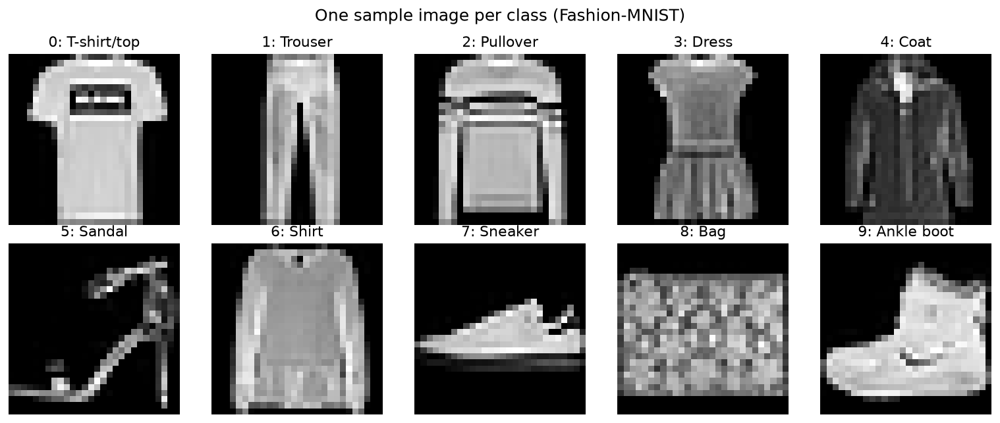
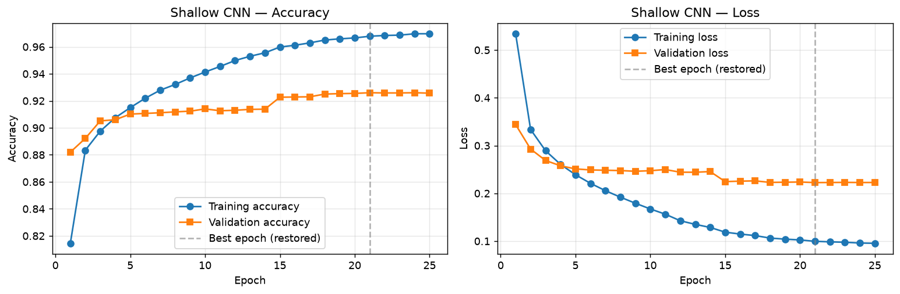
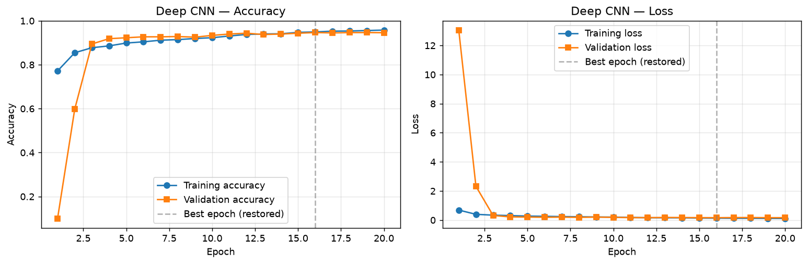
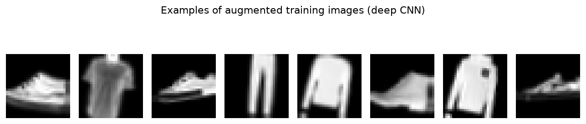
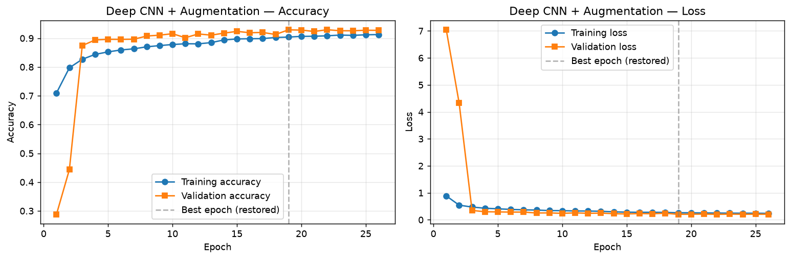
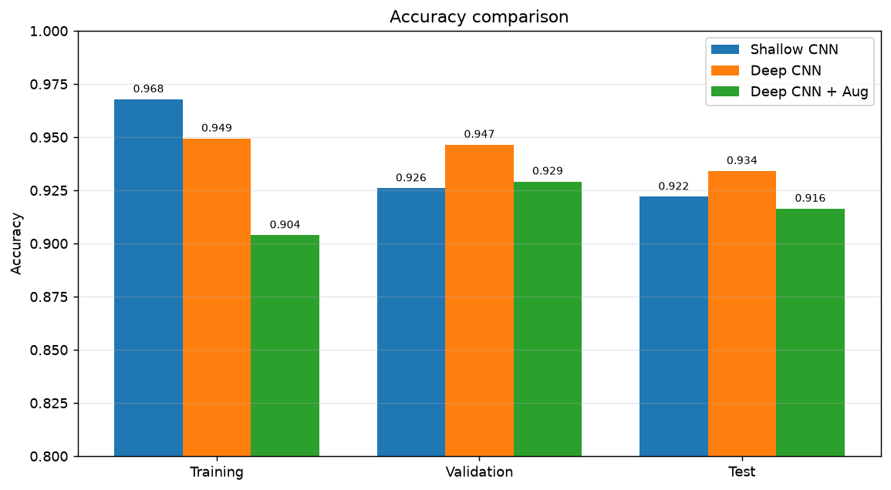
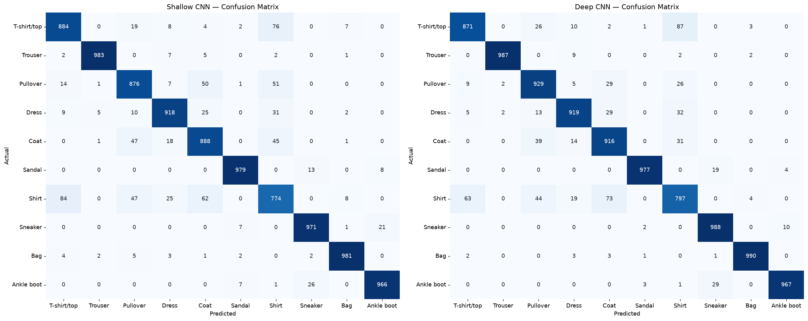
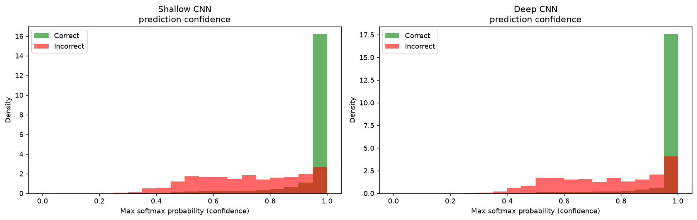
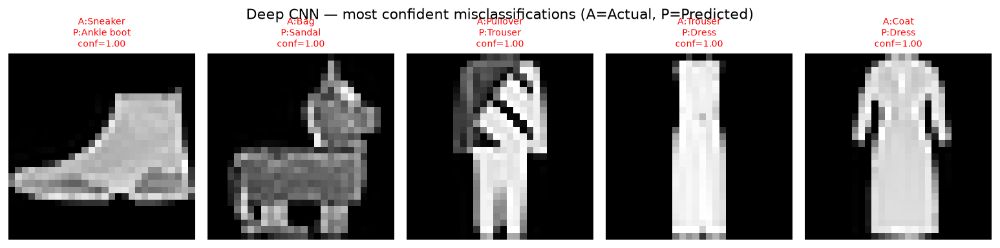

# Comparative Report: Shallow CNN vs Deep CNN on Fashion-MNIST

## 1. Objective

Perform a controlled comparison between a **shallow CNN** and a **deep CNN** on the
Fashion-MNIST dataset — training both on the same data with an identical training
setup — and determine which architecture is more suitable for this image
classification task in terms of accuracy, generalisation, and efficiency. A third
experiment adds **data augmentation** to the deep CNN to study its effect.

## 2. Dataset Overview

Fashion-MNIST consists of **70,000** 28×28 grayscale images across **10** clothing
classes (T-shirt/top, Trouser, Pullover, Dress, Coat, Sandal, Shirt, Sneaker, Bag,
Ankle boot), split into **60,000 training** and **10,000 test** images. The classes
are perfectly balanced (6,000 training images each), so plain accuracy is a fair
metric. Pixels were normalized to `[0, 1]` and images reshaped to `(28, 28, 1)` for
CNN input. A **fixed, stratified 90/10 train–validation split** (seeded) was held out
so both models see exactly the same validation data and the experiment is reproducible.

*Figure 1 — One sample per class. The distinctive items (Trouser, Bag, Sandal, Sneaker,
Ankle boot) are easy to tell apart; the upper-body garments (T-shirt, Pullover, Coat and
especially Shirt) share almost identical 28×28 silhouettes — this is where nearly all
errors will later appear.*

## 3. Preprocessing — Why Normalize and Reshape?

- **Normalization.** Raw pixels are integers `0–255`; feeding such large, unevenly-scaled
  values in makes training slow and unstable (large activations/gradients). Rescaling to
  `[0, 1]` keeps everything in a small, consistent range, so the optimizer converges faster
  and more reliably and no single large-valued feature dominates.
- **Reshaping.** A `Conv2D` layer convolves over a `(height, width, channels)` tensor. The
  images arrive as `(28, 28)` with no channel axis, so we reshape to `(28, 28, 1)` — one
  grayscale channel — otherwise the convolution cannot build.

## 4. Model Architectures

**Shallow CNN** — a minimal baseline:
`Conv2D(32) → MaxPool → Flatten → Dense(128) → Dense(10, softmax)`
(1 convolution layer, 1 pooling layer). Almost all parameters live in the `Flatten → Dense`
connection, which is powerful enough to memorise training-set detail.

**Deep CNN** — a deeper, regularised network:
`Conv2D(32) → BatchNorm → Conv2D(64) → MaxPool → Dropout(0.25) → Conv2D(128) →
BatchNorm → MaxPool → Dropout(0.25) → Flatten → Dense(256) → Dropout(0.5) →
Dense(10, softmax)` (3 convolution layers, 2 pooling layers, batch-norm + dropout). More
filters (32→64→128) build a feature hierarchy; batch-norm stabilises training; dropout
prevents over-reliance on any single feature.

**Deep CNN + Augmentation** — the same deep architecture, trained with gentle on-the-fly
augmentation (random rotation ≤4%, translation ≤6%, zoom ≤6%) on the training images only.

**Training recipe (shared for a fair comparison):** Adam optimizer, sparse categorical
cross-entropy loss, batch size 256, up to 25 epochs (35 for the augmented run), with
`EarlyStopping` (best-weight restoration) and `ReduceLROnPlateau`.

## 5. Training Behaviour (with graphs)

### Shallow CNN

*Figure 2 — Training accuracy climbs to ~0.97 while validation flattens near 0.92, and
validation loss (right) turns **upward** while training loss keeps falling. The widening gap
is textbook **overfitting**; early stopping restores the best-validation weights (dashed line).*

### Deep CNN

*Figure 3 — Training and validation rise **together** and stay close, and validation loss
**tracks** training loss instead of rising. The curves hugging each other is the signature of a
model that **generalises** rather than memorises — despite having far more capacity than the
shallow model.*

### Deep CNN + Augmentation

*Figure 4 — Augmented training images: slightly rotated/shifted/zoomed, still clearly recognisable.*

*Figure 5 — Here the **validation** curve sits slightly **above** the training curve: the model
is trained on harder (augmented) images but validated on clean ones, so it is mildly *under*-fit
to the training data — heavy regularisation, no overfitting.*

## 6. Model Comparison

| Metric | Shallow CNN | Deep CNN | Deep CNN + Aug |
|--------|-------------|----------|----------------|
| Number of Conv Layers | 1 | 3 | 3 |
| Total Parameters | 693,962 | 1,701,770 | 1,701,770 |
| Epochs Trained (early stop) | 25 | 20 | 26 |
| Training Accuracy | 96.78% | 94.94% | 90.39% |
| Validation Accuracy | 92.60% | 94.65% | 92.92% |
| Test Accuracy | 92.20% | **93.41%** | 91.64% |
| Train–Val Gap | +4.18% | +0.29% | −2.53% |
| Overfitting Observed? | Yes | No | No |
| Training Time | 127 s | 1,132 s | 1,527 s |

*(Numbers are from the executed notebook; exact values may vary slightly between runs.)*

*Figure 6 — Grouped accuracy bars. The shallow model's Training bar towers over its
Validation/Test bars (overfitting); the deep model's three bars are almost level and its Test
bar is the tallest of all; the augmented model's Training bar is the shortest (mild underfitting).*

## 7. Key Observations

- **Accuracy.** The deep CNN reached **93.41%** test accuracy versus **92.20%** for the
  shallow CNN — a **1.2 percentage-point** improvement that cuts the error rate from ~7.8% to
  ~6.6% (about a **15% relative reduction in errors**).
- **Generalisation.** The shallow CNN's training accuracy (96.78%) sits well above its
  validation accuracy (92.60%) — a **+4.18% gap** signalling **overfitting**. The deep CNN's
  gap is near zero (**+0.29%**) thanks to batch-norm and dropout: it generalises cleanly.
- **Efficiency.** The shallow CNN trained in ~**127 s** — roughly **9× faster** than the deep
  CNN's ~**1,132 s** — and uses ~2.4× fewer parameters. Efficiency is the shallow model's win.
- **Data augmentation.** Gentle augmentation drove the deep model's gap **negative** (−2.53%,
  validation above training) — strong regularisation, no overfitting — but its test accuracy
  (**91.64%**) did *not* beat the plain deep model on this clean, centred dataset. This is an
  instructive result: augmentation is **not a free accuracy win**. Its real payoff (robustness
  to geometric variation, better calibration) would appear on *perturbed* test data, and its
  strength must be matched to the data.

## 8. Prediction & Error Analysis

*Figure 7 — Confusion matrices (rows = actual, columns = predicted). Both models are near-perfect
on the distinctive classes; errors concentrate in the **Shirt / T-shirt / Pullover / Coat** block.
The deep CNN has a stronger diagonal and lighter off-diagonal cells there — it resolves more of the
hard cases.*

*Figure 8 — Confidence (top softmax probability) for correct (green) vs incorrect (red)
predictions. Both models are confident when correct, but the deep model's errors lean to **lower**
confidence — it is **better calibrated**, i.e. less often confidently wrong (the safer failure mode).*

*Figure 9 — The deep CNN's most confident mistakes: nearly all are Shirt/Pullover/Coat/T-shirt
confusions that are genuinely ambiguous at 28×28 grayscale.*

- **Easiest classes:** Trouser, Bag, Sandal, Sneaker, Ankle boot (distinctive silhouettes).
- **Most confused:** Shirt with T-shirt/top, Pullover and Coat — *Shirt* is the lowest-scoring
  class for both models.
- **Did the deep CNN reduce confusion?** Yes — larger diagonal and lighter off-diagonal counts in
  the look-alike block, plus better-calibrated confidence.

## 9. Final Conclusion

- **Recommended model:** the **deep CNN** — highest accuracy and best generalisation, no
  overfitting. Unless deployment is severely compute- or latency-constrained, it is the better default.
- **More efficient:** the **shallow CNN** — ~9× faster to train and far lighter.
- **More accurate:** the **deep CNN** (93.41% vs 92.20% test) with the smaller generalisation gap.
- **What we learned:** depth pays off, but only with the right supporting techniques. Extra
  convolution layers build a feature hierarchy that separates visually similar classes a single-conv
  model cannot — but that capacity would overfit without **batch-norm and dropout**. A **fixed
  validation split** and **early stopping** made the comparison fair and reproducible; the
  **confidence analysis** showed the regularised deep model is better calibrated; and the
  **augmentation experiment** showed a technique must be matched to the data. The core trade-off is
  concrete: **more capacity buys accuracy at the cost of compute and training time**, and
  regularisation is what turns that capacity into generalisation rather than memorisation.
